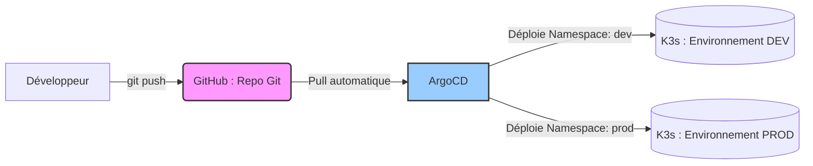
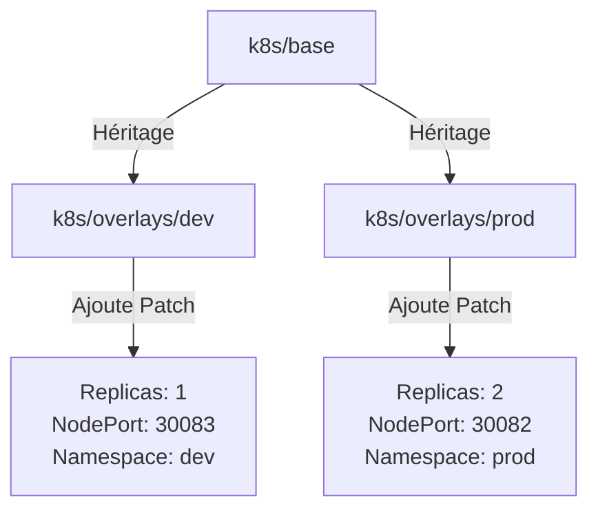
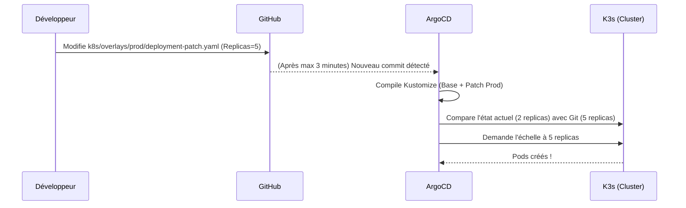

# Comprendre l'Architecture GitOps Multi-Environnement de A à Z

Ce document explique en détail le fonctionnement du projet, depuis le code source de l'application Node.js jusqu'au déploiement automatisé par ArgoCD dans Kubernetes, en gérant deux environnements isolés (DEV et PROD).

---

## 1. Vue d'ensemble de l'Architecture GitOps

Le principe du **GitOps** est de faire de Git la seule source de vérité. Personne ne modifie manuellement le cluster avec `kubectl`. Tout changement se fait par un `git push`, et un outil (ArgoCD) se charge de synchroniser le cluster.

1. **GitHub** contient le code de l'application ET les fichiers de configuration Kubernetes (Manifests).
2. **ArgoCD** scrute (poll) GitHub toutes les 3 minutes.
3. S'il détecte un changement, ArgoCD lit les fichiers **Kustomize** et déploie les ressources dans le cluster **K3s**.

---

## 2. L'Application et sa conteneurisation

Avant de parler de Kubernetes, il y a l'application elle-même.

### `app.js`
C'est le code source de l'application (en Node.js/Express). 
Elle fait 3 choses :
- Elle lit un fichier de configuration monté depuis Kubernetes (`/app/config/config.json`).
- Elle lit des variables d'environnement secrètes (`DB_USER`, `DB_PASSWORD`).
- Elle expose une API web sur le port `3000`.

### `Dockerfile`
C'est la recette pour créer l'image Docker de l'application (`node-workshop-app:v1`). Il part d'une image Node, copie `app.js` et `package.json`, installe les dépendances, et précise que l'app écoute sur le port 3000.

---

## 3. L'Architecture Kustomize (Multi-Environnement)

Pour éviter de dupliquer les fichiers YAML (Deployment, Service, etc.) pour chaque environnement, nous utilisons **Kustomize**. Kustomize permet d'avoir une "Base" commune et d'appliquer des "Surcouches" (Overlays) par dessus.

### Le dossier `k8s/base/` (Le socle commun)

C'est ici que sont définies les ressources K8s "génériques" :

- **`deployment.yaml`** : Décrit les "Pods" (les conteneurs de l'app). Il indique d'utiliser l'image `node-workshop-app:v1`, d'injecter le **Secret** en tant que variables d'environnement, et de monter le **ConfigMap** sous forme de volume de fichier.
- **`service.yaml`** : Fait office de "Load Balancer" interne. Il capte le trafic entrant et le redirige vers le port `3000` des Pods.
- **`configmap.yaml`** : Contient des données non confidentielles (ex: un message de bienvenue). Il est injecté dans le Pod sous forme de fichier.
- **`secret.yaml`** : Contient les mots de passe encodés en Base64. Il est injecté dans le Pod en tant que variables d'environnement (`DB_USER`, `DB_PASSWORD`).
- **`kustomization.yaml`** : Le fichier "maître" de la base. Il dit simplement à Kustomize : "Voici la liste des 4 fichiers qui composent mon socle".

### Les dossiers `k8s/overlays/dev/` et `k8s/overlays/prod/` (Les environnements)

Ces dossiers contiennent les spécificités de chaque environnement.

- **`kustomization.yaml`** : C'est le chef d'orchestre de l'environnement. Il dit : 
  1. "Prends tout ce qu'il y a dans `../../base`".
  2. "Met tout ça dans le namespace `dev` (ou `prod`)".
  3. "Rajoute le préfixe `dev-` devant le nom de toutes les ressources".
  4. "Applique les patches suivants".
- **`deployment-patch.yaml`** : C'est une rustine. Elle ne contient pas tout le déploiement, juste ce qui change. Par exemple, pour DEV on dit `replicas: 1`, et pour PROD on dit `replicas: 2`.
- **`service-patch.yaml`** : Pareil pour le réseau. Il écrase le port d'entrée. `nodePort: 30083` pour DEV, `30082` pour PROD (évitant ainsi les conflits).

---

## 4. ArgoCD : Le chef d'orchestre du déploiement

ArgoCD ne devine pas tout seul ce qu'il doit déployer. On lui donne des fichiers de type `Application`.

### `argocd-app-dev.yaml` et `argocd-app-prod.yaml`
Ce sont des "Custom Resources" (CRD) d'ArgoCD. 
- Elles disent à ArgoCD de surveiller le repo GitHub `https://github.com/GoujetP/tp-atelier-kubernetes`.
- L'app DEV lui dit de regarder spécifiquement dans le dossier `path: k8s/overlays/dev` et de déployer le résultat sur le cluster local dans le namespace `dev`.
- La section `syncPolicy` contient `automated: prune: true, selfHeal: true`. Cela veut dire : "Si un fichier est modifié sur Git, applique-le tout seul. Si quelqu'un supprime un pod à la main sur le cluster, recrée-le tout seul (Self-Heal)".

---

## 5. Résumé : Pourquoi faire ça ?

1. **Sécurité et Traçabilité** : Personne n'a besoin d'accès direct au serveur de production. Tout passe par Git (historique, retours en arrière possibles).
2. **Isolation** : L'utilisation des namespaces (`dev` et `prod`) et des ports différents empêche l'environnement de développement de casser la production, même s'ils tournent sur la même machine.
3. **DRY (Don't Repeat Yourself)** : Grâce à Kustomize, si vous ajoutez une nouvelle variable d'environnement dans la `base`, elle sera automatiquement héritée en `dev` et en `prod` sans avoir à copier-coller de code.
