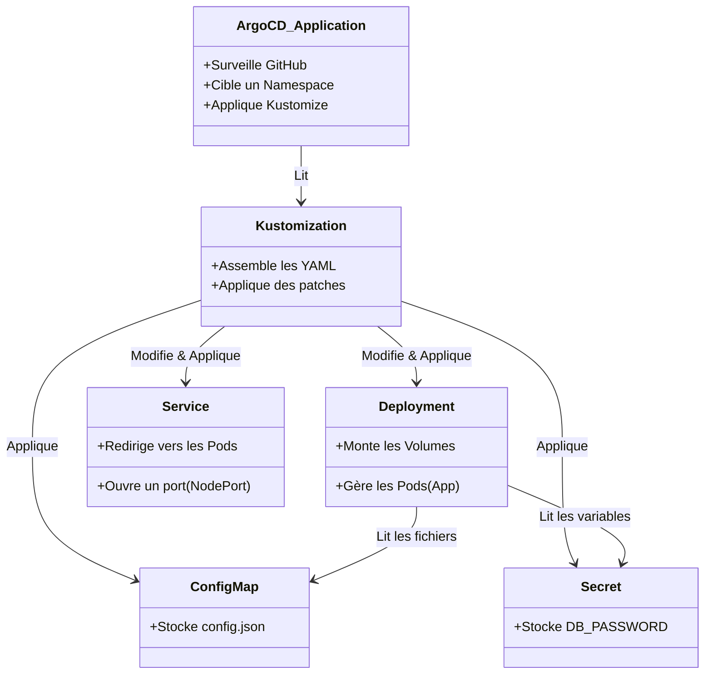

# Explication détaillée des fichiers de configuration

Ce document explique le rôle et la configuration ligne par ligne (ou bloc par bloc) des fichiers qui composent notre architecture GitOps Kubernetes.



---

## 1. Les applications ArgoCD (`argocd-app-dev.yaml` / `prod.yaml`)

Ces fichiers ne sont **pas** pour Kubernetes directement, mais pour **ArgoCD**. Ils disent à ArgoCD quoi surveiller et où le déployer.

```yaml
apiVersion: argoproj.io/v1alpha1
kind: Application
metadata:
  name: node-workshop-dev      # Le nom de l'application dans l'interface ArgoCD
  namespace: argocd            # Ce fichier doit être appliqué dans le namespace d'ArgoCD
spec:
  project: default
  source:
    repoURL: 'https://github.com/GoujetP/tp-atelier-kubernetes' # Le Git à surveiller
    targetRevision: HEAD       # Suit la branche principale (les derniers commits)
    path: k8s/overlays/dev     # Le dossier exact où ArgoCD doit chercher les manifests (Kustomize)
  destination:
    server: 'https://kubernetes.default.svc' # Le cluster K8s cible (ici, le cluster local où ArgoCD tourne)
    namespace: dev             # Le Namespace CIBLE où l'application sera déployée
  syncPolicy:
    automated:                 # Active la synchronisation automatique
      prune: true              # Si un fichier est supprimé de Git, supprime la ressource de K8s
      selfHeal: true           # Si quelqu'un modifie K8s à la main, ArgoCD écrase avec la version Git
    syncOptions:
      - CreateNamespace=true   # Si le namespace "dev" n'existe pas, ArgoCD le crée automatiquement
```

---

## 2. Le Déploiement (`k8s/base/deployment.yaml`)

C'est le cœur de l'application. Il décrit les "Pods" (vos conteneurs Docker) et comment ils tournent.

```yaml
apiVersion: apps/v1
kind: Deployment
metadata:
  name: node-app-deployment    # Nom du déploiement
  labels:
    app: node-workshop         # Étiquette utile pour que le Service retrouve ces pods
spec:
  replicas: 2                  # Nombre de conteneurs identiques à faire tourner (surchargé plus tard par Kustomize)
  selector:
    matchLabels:
      app: node-workshop       # Le contrôleur gérera les pods qui ont ce label
  template:                    # Le "moule" pour créer les pods
    metadata:
      labels:
        app: node-workshop     # Label appliqué aux pods créés
    spec:
      containers:              # Définition du conteneur
      - name: node-app
        image: node-workshop-app:v1 # L'image Docker que nous avons buildée
        imagePullPolicy: Never # Empêche K8s d'essayer de télécharger l'image sur internet (car elle est locale sur K3s)
        ports:
        - containerPort: 3000  # Le port sur lequel l'app NodeJS écoute à l'intérieur du conteneur
        
        # --- Variables d'environnement ---
        env:
        - name: DB_USER
          valueFrom:
            secretKeyRef:      # On ne met pas le mot de passe en clair, on va le lire dans un Secret !
              name: app-secrets
              key: DB_USER
        - name: DB_PASSWORD
          valueFrom:
            secretKeyRef:
              name: app-secrets
              key: DB_PASSWORD
              
        # --- Volumes ---
        volumeMounts:
        - name: config-volume  # On monte un volume appelé "config-volume"...
          mountPath: /app/config # ...dans le dossier /app/config du conteneur (là où app.js cherche config.json)
      
      volumes:                 # Définition des volumes du pod
      - name: config-volume
        configMap:             # Ce volume est en fait généré à partir du ConfigMap "app-config"
          name: app-config
```

---

## 3. Le Service (`k8s/base/service.yaml`)

Le Service agit comme un aiguilleur réseau. Les pods sont éphémères (leurs IP changent). Le Service, lui, est fixe.

```yaml
apiVersion: v1
kind: Service
metadata:
  name: node-app-service       # Nom du service (accessible en interne via ce nom)
spec:
  type: NodePort               # Ouvre un port directement sur l'IP de la machine hôte (la VM K3s)
  selector:
    app: node-workshop         # Très important : Envoie le trafic vers tous les pods ayant ce label
  ports:
    - protocol: TCP
      port: 80                 # Port exposé "à l'intérieur" du cluster pour les autres applications
      targetPort: 3000         # Le port de destination sur le conteneur NodeJS (défini dans app.js)
      nodePort: 30080          # Le port exposé sur la VM K3s physique (ex: http://10.42.0.1:30080)
```

---

## 4. Le ConfigMap (`k8s/base/configmap.yaml`)

Il stocke des données de configuration non sensibles (pas de mots de passe). Il permet de séparer le code de la configuration.

```yaml
apiVersion: v1
kind: ConfigMap
metadata:
  name: app-config             # C'est le nom référencé dans "volumes" du deployment.yaml
data:                          # Le contenu du ConfigMap
  config.json: |               # K8s va créer un fichier virtuel nommé "config.json"
    {
      "message": "Bonjour depuis le ConfigMap, l'application est bien configurée !",
      "environment": "workshop"
    }
```
*Grâce au `volumeMount` du Deployment, ce JSON sera placé dans `/app/config/config.json`.*

---

## 5. Le Secret (`k8s/base/secret.yaml`)

Stocke les informations sensibles.

```yaml
apiVersion: v1
kind: Secret
metadata:
  name: app-secrets            # C'est le nom référencé dans "env" du deployment.yaml
type: Opaque                   # Signifie "clé/valeur arbitraires"
data:
  # Attention : Les valeurs ici NE SONT PAS chiffrées, elles sont juste encodées en Base64.
  # (ex: "admin" -> "YWRtaW4=")
  DB_USER: YWRtaW4=            
  DB_PASSWORD: bW9uX3N1cGVyX21vdF9kZV9wYXNzZQ==
```

---

## 6. Kustomize : L'assemblage et les Patchs (`k8s/overlays/dev/kustomization.yaml`)

Kustomize (natif à kubectl et ArgoCD) prend la "base" et applique des modifications par-dessus, créant ainsi les environnements isolés.

```yaml
apiVersion: kustomize.config.k8s.io/v1beta1
kind: Kustomization

# 1. Héritage
resources:
  - ../../base                 # Importe TOUS les fichiers du dossier k8s/base

# 2. Renommage et Isolation
namespace: dev                 # Force toutes les ressources de la base à aller dans le namespace "dev"
namePrefix: dev-               # Ajoute "dev-" devant le nom de TOUTES les ressources 
                               # (ex: node-app-deployment devient dev-node-app-deployment)

# 3. Application des patchs
patches:
  - path: deployment-patch.yaml # Écrase certaines lignes du deployment.yaml
  - path: service-patch.yaml    # Écrase certaines lignes du service.yaml
```

**Exemple du `service-patch.yaml` :**
```yaml
apiVersion: v1
kind: Service
metadata:
  name: node-app-service       # Doit matcher le nom de la base
spec:
  ports:
    - protocol: TCP
      port: 80
      targetPort: 3000
      nodePort: 30083          # Remplace le 30080 de la base par 30083 pour le DEV !
```
